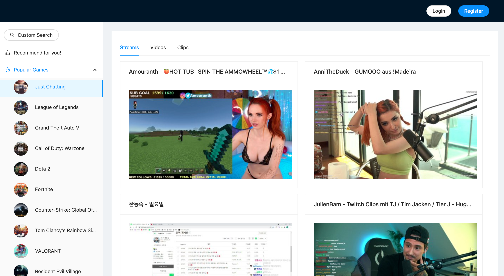
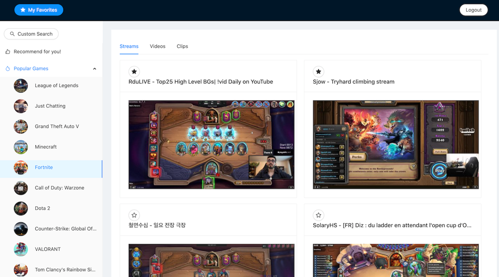

## VisualHunter

### Overview
VisualHunter is a personalized Twitch resources recommendation engine. Users can search and retrieve real-time Twitch resources using Twitch API and make their favorite collection. They can then get recommended based on trending games or their like history.

### Tools and Technologies
* <strong>Front-end: </strong>React.js, Ant Design
* <strong>Back-end: </strong>JavaEE, Apache Tomcat, MySQL (AWS RDS)
* <strong>Retrieving Games: </strong>Twitch APIs
* <strong>Recommendation: </strong>A content-based algorithm implemented in Java
* <strong>Authentication: </strong>Cookie-based auth
* <strong>Deployment: </strong>AWS EC2

### Main Features

* Supports basic login/logout function
* Users can search any game they like and get some top results grouped by streams/videos/clips, and view them on Twitch.tv
* Users can like/unlike a game resource and check it later on their favorite collection page
* Users will get recommended either by most popular games or by their own like history

### References
* [Create-react-app docs](https://facebook.github.io/create-react-app/docs/getting-started)
* [Twitch API docs](https://dev.twitch.tv/docs/api/)

 <em>Rui Zhang</em>
  December 9, 2021
